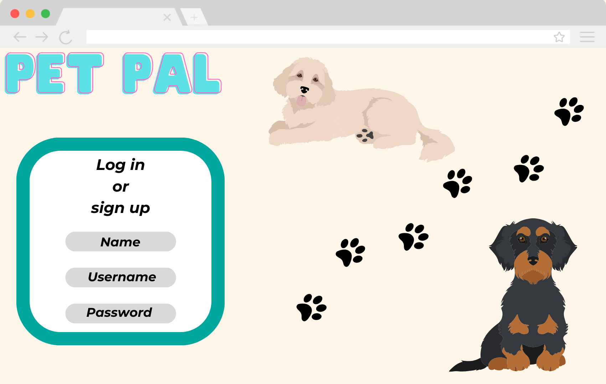
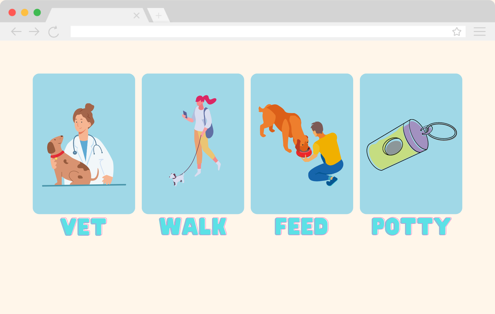
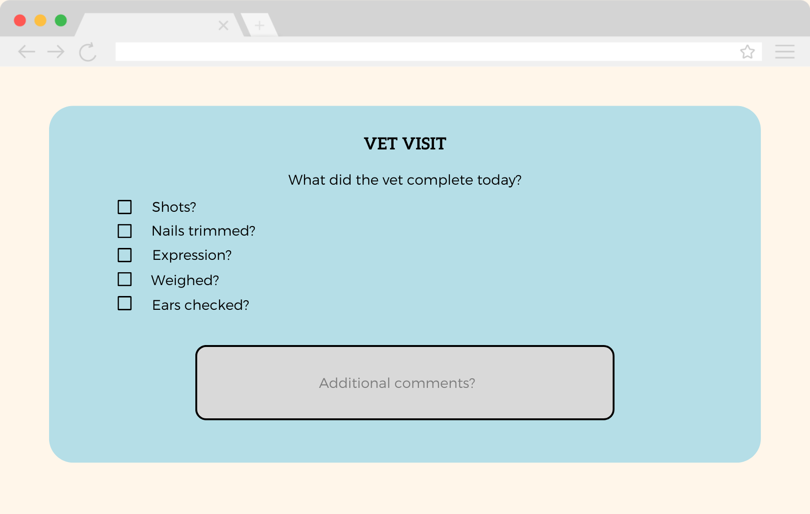
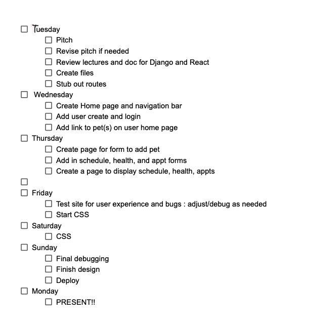
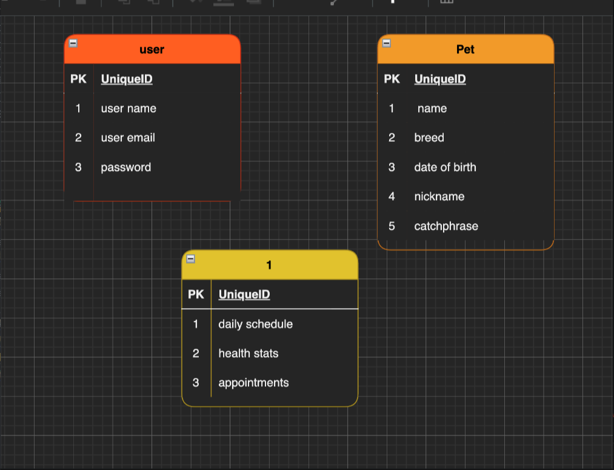

# Pet Pal

##Tech stack

- Django
- React
- HTML
- Tailwind
- Css

## App description
Pet Pals is a fur-friendly application! With Pet Pals, you can keep track of feeding schedules, vet vists, potty trips, and walks. Did your pet just have a vet visit? Log it on our vet visit form. Keep track of their weight, shots, or when they need their flea medicine. You can also keep track of the last time your pet was let out or went potty. Log your pet walks and how long you were getting some good exercise. Have multiple pets? Great! Add them all under your user to get started!

## Wireframes

## User Stories
- As a user I would like to make an account and log on
- as a user I would like to make a pet 'user' 
- as a user I would like to log vet visits on the vet form
- as a user I would like to log how long i walked my pet
- as a user i would like to see a schedule of when i have and haven't fed my pet
- as a user i would like to see a list of potty trips
- as a user i would like to be able to log potty trips
- as a user i would like to be able to add multiple pets

## Team
- Michelle Elek
- Megan Benn

## Work Schedule

## ERD

##RESTful Routes

### Users

| HTTP METHOD (_Verb_) | URL (_Nouns_) | CRUD | Response                                                   | Notes |
| -------------------- | ------------- | ---- | ---------------------------------------------------------- | ----- |
| POST                 | /users        | C    | create new user                                            |       |
| GET                  | /users/:id    | R    | show user's profile including their goal lists             |       |
| PUT                  | /users/:id    | U    | edit the user's profile                                    |       |
| POST                 | /users/login  | C    | accept a payload of form data and use it to login the user |       |

### Pet

| HTTP METHOD (_Verb_) | URL (_Nouns_)  | CRUD | Response                                       | Notes |
| -------------------- | -------------- | ---- | ---------------------------------------------- | ----- |
| POST                 | /pet           | C    | create a new pet                               |       |
| GET                  | /              | R    | Homepage                                       |       |
| PUT                  | /pet/:id       | U    | edit a pet                                     |       |
| DELETE               | /pet/:id       | D    | remove pet from user's profile                 |       |

### Pet diary
| HTTP METHOD (_Verb_) | URL (_Nouns_) | CRUD | Response                                                   | Notes |
| -------------------- | ------------- | ---- | ---------------------------------------------------------- | ----- |
| POST                 | /diary        | C    | create new entry                                           |       |
| GET                  | /diary/:id    | R    | show pet's diary                                           |       |
| PUT                  | /diary/:id    | U    | edit the pet's diary                                       |       |
| DELETE               | /diary/:id    | C    | Delete an entry in the pet diary                           |       |
